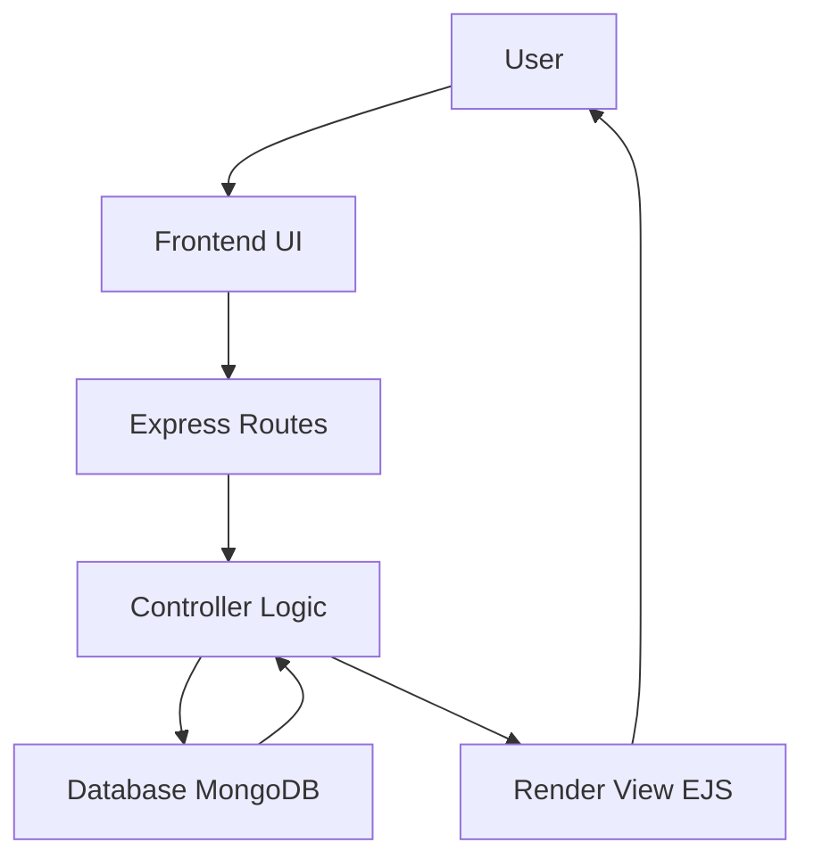

# 🏠 Room Booking Application
A **full-stack room booking platform inspired by Airbnb** where users can browse properties, view room details, and manage bookings.<br><br>
This project demonstrates **backend development, MVC architecture, database integration, and REST API design**.

# ✨ Features

🔍 Browse available rooms<br>
🏡 View detailed property listings<br>
📸 Upload room images<br>
➕ Add new room listings<br>
✏️ Update property details<br>
❌ Delete listings<br>
🔐 Session based authentication<br>
📦 RESTful CRUD APIs<br>
🎨 Server-side rendering with EJS<br>

---

# 🧰 Tech Stack

## 💻 Frontend

* HTML5
* CSS3
* Tailwind CSS
* EJS Templates

## ⚙️ Backend

* Node.js
* Express.js

## 🗄 Database

* MongoDB
* Mongoose ODM

## 📦 Libraries

* Multer → file uploads
* Express-session → authentication sessions
* Connect-mongo → session storage
* Nodemon → development server

---

# 🧭 Project Architecture

This project follows **MVC (Model View Controller)** architecture.

```
User Request
     │
     ▼
Routes
     │
     ▼
Controllers
     │
     ▼
Models (MongoDB)
     │
     ▼
Views (EJS Templates)
     │
     ▼
Response to Client
```

---

# 🔄 Application Flow



---

# 📁 Project Structure

```
Room-Booking-Application
│
├── controllers
│   ├── hostController.js
│   └── storeController.js
│
├── models
│   └── listingModel.js
│
├── routes
│   ├── hostRouter.js
│   └── storeRouter.js
│
├── views
│   ├── layouts
│   └── pages
│
├── public
│   ├── css
│   └── images
│
├── uploads
│
├── utils
│
├── app.js
└── package.json
```

---

# ⚙️ Installation

## 1️⃣ Clone the repository

```bash
git clone https://github.com/Ayush-git403/Room-Booking-Application.git
```

---

## 2️⃣ Go into the project folder

```bash
cd Room-Booking-Application
```

---

## 3️⃣ Install dependencies

```bash
npm install
```

---

## 4️⃣ Setup Environment Variables

Create `.env` file

```
MONGO_URI=your_mongodb_connection_string
SESSION_SECRET=your_secret_key
```

---

## 5️⃣ Run the server

```bash
npm start
```

or

```bash
nodemon app.js
```
# 🚀 Future Improvements

⭐ User authentication with JWT<br>
⭐ Payment gateway integration<br>
⭐ Booking calendar<br>
⭐ Reviews & ratings<br>
⭐ Search & filters<br>
⭐ Cloud image storage<br>

---

# 📚 What I Learned

✔ Building REST APIs with Express<br>
✔ Implementing MVC architecture<br>
✔ MongoDB database design<br>
✔ File upload handling with Multer<br>
✔ Session based authentication<br>
✔ Structuring full-stack projects<br>

---

# 👨‍💻 Author

**Ayushman Srivastava**<br>

🎓 B.Tech Computer Science Engineering<br>
🔗 GitHub
https://github.com/Ayush-git403

# 📜 License

This project is created for **learning and educational purposes**.
